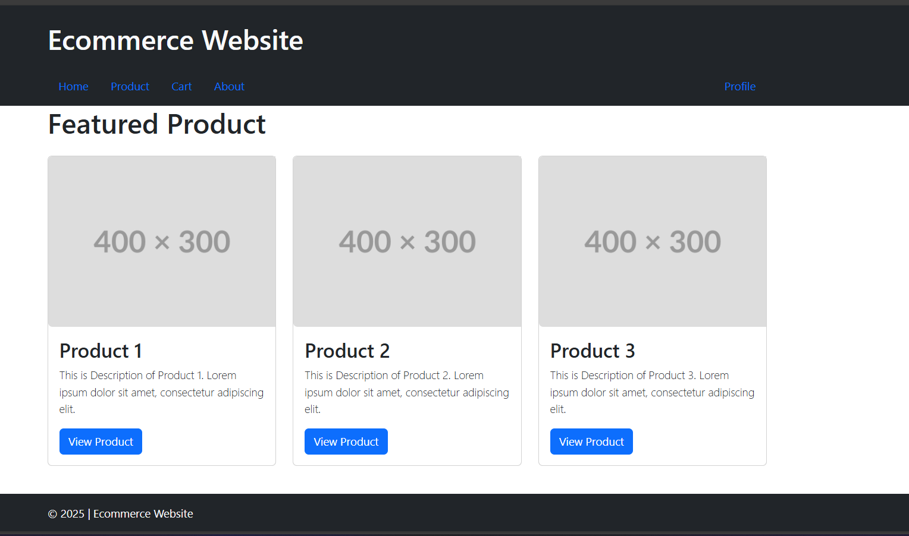
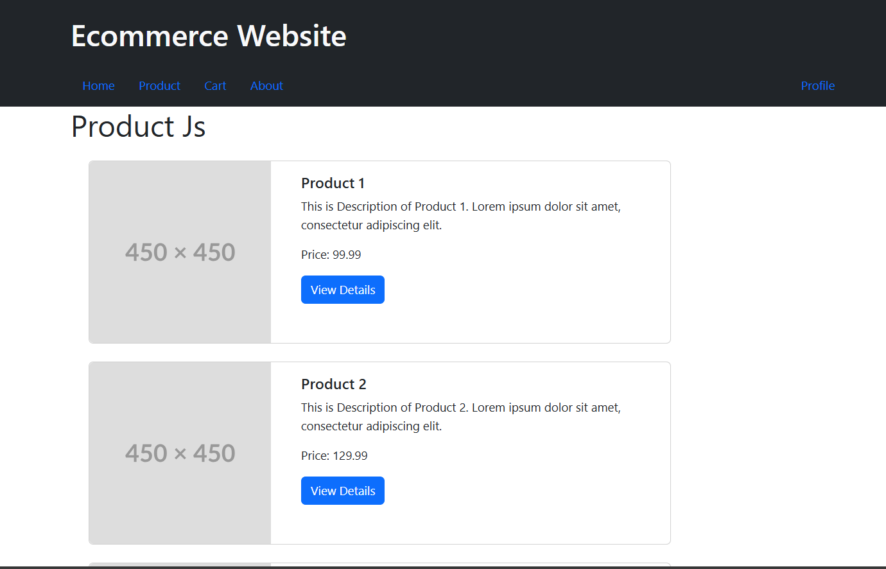
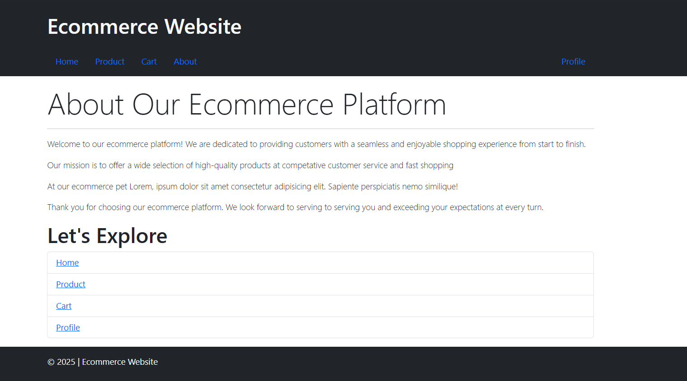

# 🛒 E-Commerce App (Dynamic Routing)

  
  
  
  

---

## 🔍 Purpose  

The **E-Commerce App** is a web-based application designed to simulate a simple online shopping experience.  
It uses **React + React Router DOM** for **dynamic routing**, providing smooth navigation between product listings, product details, and user profile.  

- 🛍️ **Browse Products**  
- 📖 **Product Details Page** (Dynamic routes)  
- 👤 **User Profile with Update option**  
- 🚦 **Navigation with React Router DOM**  
- 🎨 **Styled using Bootstrap**  

---

***

## 🚀 Tech Stack  

> React (Functional Components + Hooks)  

> React Router DOM (Dynamic Routing with `createBrowserRouter` & `RouterProvider`)  

> Bootstrap (UI Styling)  

---

***

## [GO LIVE](https://codesandbox.io/p/sandbox/ir3-1-assignment1-2qsjrv)  

  
---  
  
---  
  
---  

---

## 🧭 Core Features  

- 🛍️ **Product Listing** (Grid view with Bootstrap)  
- 🔗 **Dynamic Routing with React Router DOM**  
  - `Product/:id` → **Product Details Page**  
  - `/profile` → **User Profile Page**  
- 📱 **Responsive UI with Bootstrap**  
- ⚡ **Component-based Architecture** (ProductCard, ProductList, Navbar, Profile, etc.)  

---

## 🧑‍💻 Skills Gained in the Project

- Building React Components for modular design.

- Implementing dynamic routing using createBrowserRouter & RouterProvider.

- Managing URL params for product details page.

- Designing a responsive UI with Bootstrap.